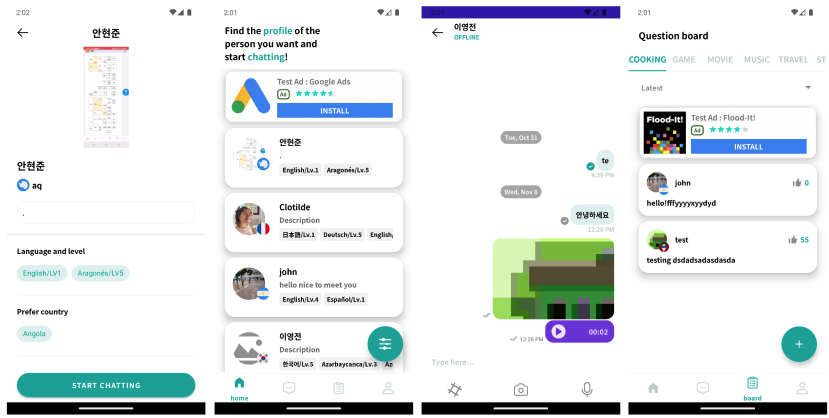

# lingo-swap

## Introduction
### Korean

### English

The Main Project that was carried out during the SW Maestro 14th

This is a free application that can be used to make foreign friend and chatting with them using various question made by other users!

[You can try out my app on PlayStore!](https://play.google.com/store/apps/details?id=com.lighthouse.lingo_talk)

***

## TechStack
| 
**Category**
 | 
**Details**
 |
| --- | --- |
| Architecture | MVVM, Clean Architecture, Clean Architecture, Hilt |
| Concurrent | Coroutine, flow |
| AAC | Databinding, LiveData, ViewModel, Navigation, Lifecycle, camerax |
| Third party | OkHttp3, Retrofit2, Glide, Firebase, Sendbird, Google login, Google admob |
| Language | Kotlin |

***
## Architecture

### Multi-Module Structure

### Clean Architecture Structure

- App Module
  - Know and dependent on all other module.
  - Initialize SendBird, Firebase, navigation and Hilt module.

- Data layer
  - Contain DataSource, DataStore, Network, Repository implementation and model (DTO).
  - Get data from server and store it in DTO.
  - Check if network call is successful and handle network error throw it to domain layer.
  - convert DTO to VO for the presentation layer.

- Domain layer
  - Pure java/kotlin module, this module have the complex business model.
  - Contain UseCase, model (VO), logger, repository interface. 

- Presentation layer
  - Auth Module: Register and login fragment.
  - Board Module: add and view Questions fragment.
  - Chat Module: Chat made by Customizing sendbird library.
  - Home Module: Matching, filter fragment.

- Common-ui Module
  - Contain repeatedly used UI related code.
      - simpleAdapter for showing a list.
      - chip, recyclerview tile layout.
      - BaseFragment, BaseActivity, BaseViewModel.
      - Constant, StringSet.

- Navigation Module
  - All the logic needed for navigating between screen.
    - Nested Navigation.
    - Deep Link.
    - Managing intent.
   
- lighthousei18n
  - All the logic needed for storing and changing currency style according to user default language setting
 
- swm-logging
  - All the logic needed for creating and sending log to server
   

